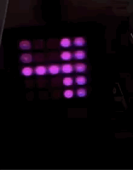

# ESP32_FlashLED_5x5  
A simple 5x5 matrix w/ FastLED
  

 &nbsp;&nbsp;&nbsp;  
  

## References
  - [Arduino FastLED](https://github.com/FastLED/FastLED) Arduino FastLED library code at Github.
  - [BPIbit wiki](https://github.com/junhuanchen/BPI-BIT-Arduino/wiki) BPIbit wiki (An microbit like ESP32 board).
  - [Dots5x5 ttf font](https://blogfonts.com/5x5-dots.font)5x5 ttf font 
  - [The Dot Factory](http://www.eran.io/the-dot-factory-an-lcd-font-and-image-generator/)An LCD Font and Image Generator.
